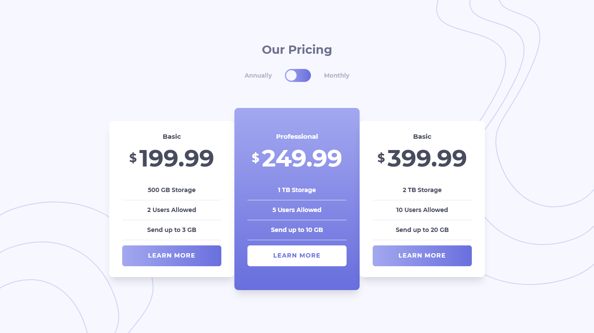
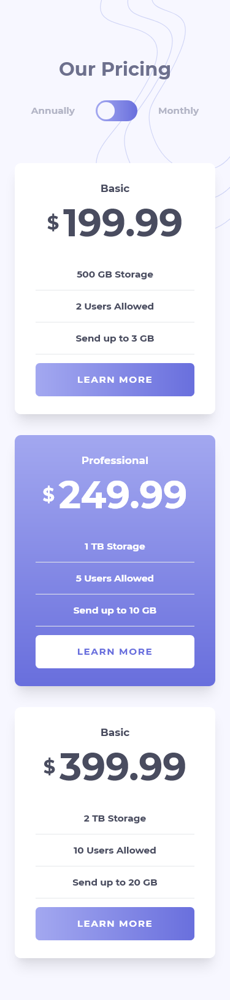

# Frontend Mentor - Pricing component with toggle solution

This is a solution to the [Pricing component with toggle challenge on Frontend Mentor](https://www.frontendmentor.io/challenges/pricing-component-with-toggle-8vPwRMIC). Frontend Mentor challenges help you improve your coding skills by building realistic projects. 

## Table of contents

- [Overview](#overview)
  - [The challenge](#the-challenge)
  - [Screenshot](#screenshot)
  - [Links](#links)
- [My process](#my-process)
  - [Built with](#built-with)
  - [What I learned](#what-i-learned)
  - [Continued development](#continued-development)
  - [Useful resources](#useful-resources)
- [Author](#author)

## Overview

### The challenge

Users should be able to:

- View the optimal layout for the component depending on their device's screen size
- Control the toggle with both their mouse/trackpad and their keyboard
- **Bonus**: Complete the challenge with just HTML and CSS

### Screenshot

#### Large Devices


#### Medium Devices


#### Small Devices


### Links

- Solution URL: [https://www.frontendmentor.io/solutions/pricing-component-with-toggle-using-tailwind-css-_F5QQfuch](https://www.frontendmentor.io/solutions/pricing-component-with-toggle-using-tailwind-css-_F5QQfuch)
- Live Site URL: [https://mvsgarcia.github.io/Pricing-component-with-toggle/](https://mvsgarcia.github.io/Pricing-component-with-toggle/)

## My process

### Built with

- [Tailwind CSS](https://tailwindcss.com/) - A utility-first CSS framework 
- Semantic HTML5 markup
- CSS custom properties
- CSS Grid
- Flexbox
- Vanilla JavaScript
- Mobile-first workflow


### What I learned

I learned that you use an **input tag** with a type of **checkbox** for toggle switches.

This is the code to animate the slide for the toggle dot when clicked:

```css
input:checked ~ .dot {
  transform: translateX(125%);
  }
```

This is the script to make the toggle functional to hide and to show the price for annual and monthly pricing:

```js
function myFunction() {
    var x = document.querySelectorAll('#annual');
    var y = document.querySelectorAll('#month');
    for (var i = 0; i < x.length; i++) {
        if (document.getElementById("toggle").checked == true) {
            x[i].classList.add('hidden');
            y[i].classList.remove('hidden');
        } else {
            x[i].classList.remove('hidden');
            y[i].classList.add('hidden');
        }
    }
}
```

Moreover, I also added a custom css to scale down or up the components depending on the device. Here's how I did it:

```css
.scale-85 {
  --tw-scale-x: .85;
  --tw-scale-y: .85;
  }
```

I also learned a cleaner way of using fonts:

```html
<head>
  <link href="https://fonts.googleapis.com/css2?family=Montserrat:wght@700&display=swap" rel="stylesheet">
  <style>
    .font-montserrat { font-family: 'Montserrat', sans-serif;}
  </style>
<head>
```

### Continued development

Find a better way of positioning the background elements.


### Useful resources

- [Tailwind CSS Documentation](https://tailwindcss.com/docs) - This helped me get started with Tailwind CSS.
- [W3Schools HTML Tutorial](https://www.w3schools.com/html/) - This is an amazing website to review HTML concepts.
- [How to - Toggle Switch](https://www.w3schools.com/howto/howto_css_switch.asp) - Toggle switch basics.
- [JS Click Event](https://github.com/mvsgarcia/Responsive-Tailwind-CSS-Practice/blob/main/index.js) - My code from a project that also uses a click event. You can use add/remove or toggle, whichever suits best.

## Author

- LinkedIn - [@mvsgarcia](https://www.linkedin.com/in/mvsgarcia/)
- Frontend Mentor - [@mvsgarcia](https://www.frontendmentor.io/profile/mvsgarcia)
